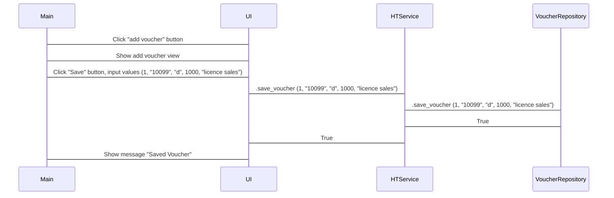
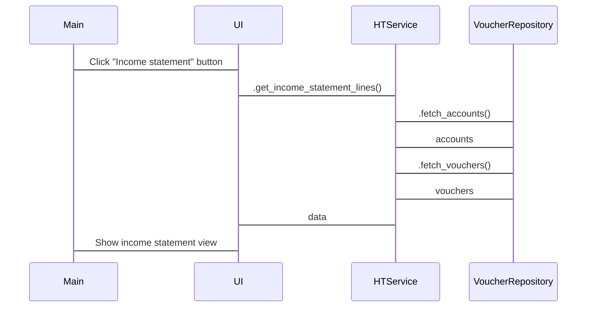

# Arkkitehtuurikuvaus

## Rakenne
Ohjelman rakenteella on kolme tasoa:  
  
Pakkaus ui vastaa käyttöliittymästä, services vastaa sovelluslogiikasta ja repositories vastaa tietokannasta. Pakkaus entities sisältää luokkia jotta käytetään sovelluksen datan tallentamiseen ja esittämiseen services- ja repositories-tasoilla.

## Käyttöliittymä

Käyttöliittymä sisältää viisi eri näkymää:  
 - Päänäkymä/ valikko
 - Tositteen lisääminen
 - Kaikkien tositteiden listaesitys
 - Tuloslaskelma
 - Tilikartta / tilien lisääminen

 Käyttöliittymä on toteutettu niin, että joka näkymä on oma luokkansa, ja luokka UI näyttää eri näkymät. Käyttöliittymä kutsuu vain HTService-luokan metodeja.

## Tietojen pysyväistallennus

Pakkauksen repositories luokka VoucherRepository huolehtii tietojen tallettamisesta. Tiedot tallennetaal SQLite-tietoantaan data-kansiossa.

## Päätoiminnallisuudet

Tässä nähdään sekvenssikaavio tositteen tallentamisesta:  

Sekvenssikaavio tuloslaskelman muodostamisesta:

