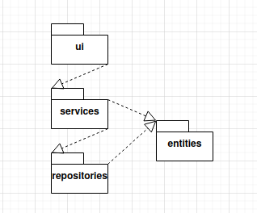

# Arkkitehtuurikuvaus

## Rakenne
Ohjelman rakenteella on kolme tasoa:  
  
Pakkaus ui vastaa käyttöliittymästä, services vastaa sovelluslogiikasta ja repositories vastaa tietokannasta. Pakkaus entities sisältää luokkia jotta käytetään sovelluksen datan tallentamiseen ja esittämiseen services- ja repositories-tasoilla.

## Käyttöliittymä

## Sovelluslogiikka

## Tietojen pysyväistallennus

Pakkauksen repositories luokka VoucherRepository huolehtii tietojen tallettamisesta. Tiedot tallennetaal SQLite-tietoantaan data-kansiossa.

## Päätoiminnallisuudet

```mermaid
title Save voucher

Main->UI: Click "add voucher" button
UI->Main: Show add voucher view
Main->UI: Click "Save" button, input values (1, "10099", "d", 1000, "licence sales")
UI->HTService: .save_voucher (1, "10099", "d", 1000, "licence sales")
HTService->VoucherRepository: .save_voucher (1, "10099", "d", 1000, "licence sales")
VoucherRepository->HTService:True
HTService->UI:True
UI->Main:Show message "Saved Voucher"
```