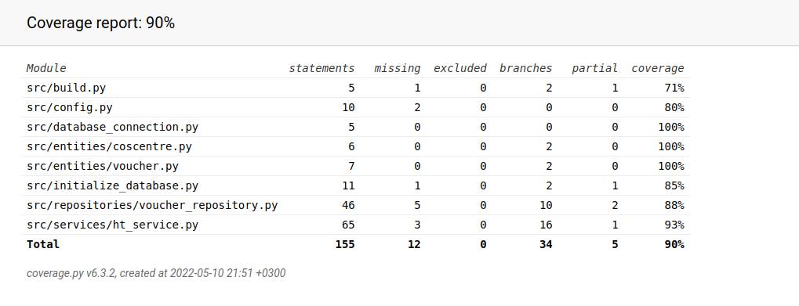

# Testausdokumentti
## Testikattavuus

Testikattavuus on 90%  (paitsi käyttöliittymäkerros).
Tässä testataan entities-kerrosta (entities_test.py) sekä services-kerrosta (services_test.py).  
Repositories-kerrosta testataan services-kerroksen kautta.

## Asennus ja käyttöliittymä
Asennusta on testattu manualisesti linux-tyypisellä käyttöjärjestelmällä.
Käyttöliittymää on testattu manualisesti.
