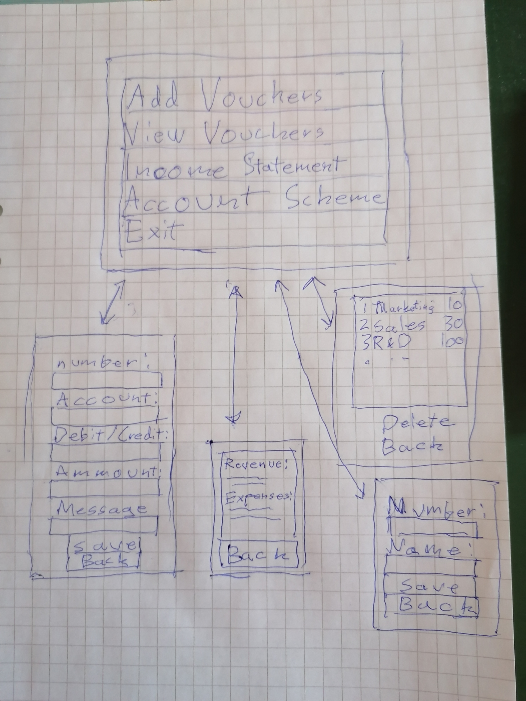

# Vaatimusmäärittely
## Sovelluksen tarkoitus
Sovelluksen tarkoitus on toimia yksinkertaisena kirjanpitoohjelmana. Käyttäjä pystyy syöttämään debet-  ja kredit-tapahtumia, ja ohjelma pystyy tuottamaan tuloslaskelman.
## Käyttäjät
Sovelluksessa on vain yksi käyttäjärooli. 
## Käyttöliittymäluonnos
Sovellus tulee koostua kuudesta eri näkymästä.

## Toiminnallisuus
### Kirjautuminen
- Organisaatio toimii kirjautumisena.
- Käyttäjä kirjoitta organisaation nimen.
- Jos organisaatiota ei löydy kysytään jos sitä halutaan luoda.
### "Perusnäkymässä"
- Parusnäkymästä voi siirtyä seuraaviin:
  - Lisää tosite
  - Tositteet
  - Tuloslaskelma
  - Tilikartta

### Lisää tosite
Käyttäjä valitsee tositenumeron, kustannuspaikan, debet/kredit ja lisää selityksen.

### Tositteet
Käyttäjä voi katsella tositteita ja poistaa niitä halutessaan.

### Tuloslaskelma
Ohjelma luo tuloslaskelman ja esittää sen ruudulla.

- Jos on aikaa niin saatetaan lisätä toiminnallisuus tallentaa jonkinlaisena dokumenttina.

# Tilikartta
Käyttäjä voi lisätä ja poistaa kustannuspaikkoja.
